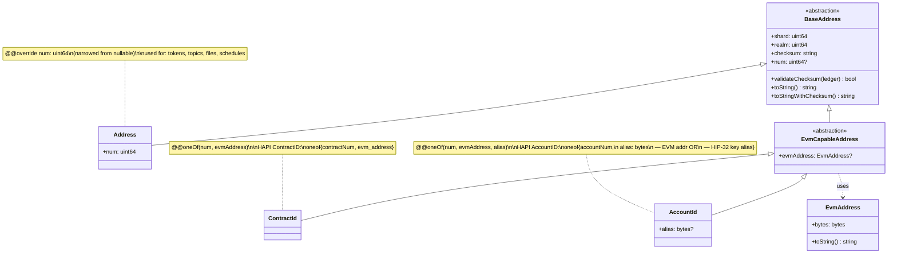

# Ledger API

## Description

This namespace hosts the foundational network / addressing types that every other namespace
builds on.

### The address hierarchy

Every entity on a Hiero ledger lives in a `(shard, realm)` space; what differs between entity
kinds is only the **selector** — the third part of the identifier that picks the specific
entity within `(shard, realm)`. That observation drives the type hierarchy:



Nullable fields are marked with a trailing `?` in the diagram (Mermaid has no native
nullable notation); in the spec they carry `@@nullable`. The `num` slot lives on
`BaseAddress` as `@@nullable` and is **narrowed** to non-null on `Address` via
`@@override` — see the *Narrowing inherited nullability* section in
[`api-guideline.md`](../../guidelines/api-guideline.md) for the full rule.

- **`BaseAddress`** is an `abstraction` carrying the shared `(shard, realm, checksum)` and
  the `@@nullable num: uint64` slot, plus the common string / checksum methods. Never
  instantiated directly. The `num` slot is `@@nullable` here because some child kinds
  (EVM-only `ContractId` / `AccountId`) do not carry one.
- **`Address`** is the concrete address kind for entities whose HAPI id is purely
  `(shard, realm, num)`: tokens, topics, files, schedules. It **narrows** the inherited
  `num` slot to non-nullable via `@@override num: uint64` — on every `Address` instance,
  `num` is guaranteed to be set. Also the typed identifier used throughout the spec wherever
  a single-number entity is referenced.
- **`EvmCapableAddress`** is an `abstraction` for entities that can be addressed either
  numerically or by a 20-byte EVM address. Adds the `@@nullable evmAddress: EvmAddress` slot
  shared by `ContractId` and `AccountId`; `num` is inherited from `BaseAddress`, still
  `@@nullable`. Does **not** itself carry an `@@oneOf` — each concrete child tightens the
  constraint with its own `@@oneOf`, which is the LSP-safe direction (subtypes may
  strengthen invariants, never weaken them).
- **`ContractId`** mirrors HAPI's `ContractID` oneof. Structurally empty — `num` and
  `evmAddress` are inherited; ContractId's only contribution is the `@@oneOf(num, evmAddress)`
  constraint.
- **`AccountId`** mirrors HAPI's `AccountID`, but **splits** the opaque `bytes alias` field
  of HAPI into two typed slots — `evmAddress: EvmAddress` (HIP-583 EVM-alias, inherited from
  `EvmCapableAddress`) and `alias: bytes` (HIP-32 public-key alias) — so the type system
  tells the caller which alias form they hold instead of forcing a runtime length check.

The hierarchy is **strictly Liskov-clean**: every child either adds new fields, narrows an
inherited nullability via `@@override` (a tightening), or adds its own `@@oneOf` constraint
(also a tightening). Nothing in the hierarchy weakens a parent invariant. The single
meta-language addition this required is the *Narrowing inherited nullability* rule
documented in [`api-guideline.md`](../../guidelines/api-guideline.md); the `@@oneOf`
constraints sit on the concrete children only, so no constraint widening is needed.

`EvmAddress` is the value type for raw 20-byte EVM addresses — used both as the
`evmAddress` slot in `EvmCapableAddress` and as a stand-alone return type wherever a flat
EVM address appears (mirror-node responses, contract-call results, ...).

## API Schema

```
namespace ledger
requires {NativeTokenUnit} from nativeToken

// Represents a specific ledger instance
Ledger<$$Unit extends NativeTokenUnit> {
    @@immutable id: bytes // identifier of the ledger
    @@immutable @@nullable name: string // human readable name of the network
    @@immutable nativeTokenUnit: $$Unit
}

// Abstract base for every entity identifier that lives in the (shard, realm)-space of a Hiero
// ledger. Every concrete address kind has a num "slot" (the numeric selector within
// (shard, realm)) — required on Address, optional on EvmCapableAddress and its children. The
// shared methods (checksum validation, string formatting) live here as well. Never
// instantiated directly. See the description above for the full hierarchy.
abstraction BaseAddress {
    @@immutable shard: uint64                                 // shard number
    @@immutable realm: uint64                                 // realm number
    @@immutable checksum: string                              // protocol-side checksum over the (shard, realm, selector) form; empty string when no checksum applies (e.g. an EVM-address-only ContractId / AccountId before materialisation)
    @@immutable @@nullable num: uint64                        // Hiero entity number. NULLABLE here because EVM-form ContractId / AccountId can be addressed without a num. Tightened to non-nullable on `Address` via @@override (see api-guideline.md → Narrowing inherited nullability).

    // Validates the checksum against the given ledger's checksum scheme.
    bool validateChecksum(ledger: Ledger<ANY>)

    // Canonical string form. Subtype-specific: "shard.realm.num" for Address / numeric-form
    // ContractId / numeric-form AccountId; "shard.realm.0x<hex>" for EVM-form ContractId /
    // AccountId; "shard.realm.<base32-hex>" for key-alias-form AccountId.
    string toString()

    // toString() with an appended "-<checksum>" suffix when a non-empty checksum is set.
    string toStringWithChecksum()
}

// Concrete address with a single numeric selector. Used for entities whose HAPI id is purely
// (shard, realm, num): tokens, topics, files, schedules. NOT used for accounts or contracts —
// those carry additional selector variants (see ContractId / AccountId below). This is also
// the typed identifier referenced throughout the spec wherever a single-num entity appears.
@@finalType
Address extends BaseAddress {
    @@immutable @@override num: uint64                        // tightening: on Address, num is always set
}

// 20-byte EVM address — a flat, single-value identifier for EVM-side entities. NOT a
// (shard, realm, num) tuple; therefore cannot extend BaseAddress. Used as the EVM-form
// selector inside ContractId and AccountId, and as a stand-alone value type wherever an EVM
// address appears on its own.
type EvmAddress {
    @@immutable @@minLength(20) @@maxLength(20) bytes: bytes   // 20 raw bytes (network byte order)

    // Canonical EIP-55-style "0x<40 hex chars>" form.
    string toString()
}

// Parses an EvmAddress from its hex-string form. Accepts both "0xabc…" and bare "abc…"
// (40 hex chars). Throws illegal-format on anything else (wrong length, non-hex characters).
@@throws(illegal-format) @@static EvmAddress EvmAddress.fromString(value: string)

// Wraps raw bytes. `value.length` must equal 20; otherwise throws illegal-format.
@@throws(illegal-format) @@static EvmAddress EvmAddress.fromBytes(value: bytes)

// Abstract subtype of BaseAddress for entities that can be addressed either by their numeric
// Hiero id (shard, realm, num) OR by a 20-byte EVM address. `num` is inherited from
// BaseAddress (still @@nullable here — no @@override). Adds the @@nullable evmAddress slot
// shared by ContractId and AccountId. Does NOT itself carry an @@oneOf — each concrete child
// tightens the constraint with its own @@oneOf, which is the LSP-safe direction.
abstraction EvmCapableAddress extends BaseAddress {
    @@immutable @@nullable evmAddress: EvmAddress             // 20-byte EVM-side address; absent when addressed by Hiero number only
}

// Identifier of a smart contract. A contract may be addressed either by its numeric Hiero id
// (shard, realm, num) or by its 20-byte EVM address (e.g. from CREATE / CREATE2 / EIP-1014).
// HAPI carries this as `ContractID { shardNum, realmNum, oneof { contractNum, evm_address } }`;
// this type mirrors that wire shape exactly.
@@oneOf(num, evmAddress)
@@finalType
ContractId extends EvmCapableAddress {
    // Structurally empty — `num` and `evmAddress` are inherited from EvmCapableAddress.
    // ContractId's only contribution over its parent is the @@oneOf constraint.
}

// Parses "shard.realm.num" or "shard.realm.0x<40-hex>" (with optional "-<checksum>" suffix).
@@throws(illegal-format) @@static ContractId ContractId.fromString(value: string)

// Builds a ContractId from a 20-byte EVM address.
@@static ContractId ContractId.fromEvmAddress(shard: uint64, realm: uint64, address: EvmAddress)

// Identifier of an account. An account may be addressed either by its numeric Hiero id
// (shard, realm, num), by a 20-byte EVM-address alias (HIP-583), or by a HIP-32 public-key
// alias (a serialised public key used to derive the account before an explicit account
// number is assigned).
//
// HAPI carries this as `AccountID { shardNum, realmNum, oneof { accountNum, alias: bytes } }`
// where the bytes-alias is opaque on the wire: a 20-byte payload is interpreted as an EVM
// address (HIP-583), a longer payload is interpreted as a serialised public key (HIP-32). V3
// splits that single HAPI alias slot into two typed fields (`evmAddress`, inherited from
// EvmCapableAddress, and `alias`) so the type system tells the caller which alias form they
// hold — no length-checking by callers.
@@oneOf(num, evmAddress, alias)
@@finalType
AccountId extends EvmCapableAddress {
    @@immutable @@nullable alias: bytes                       // serialised public-key alias (HIP-32); absent when addressed by Hiero number or by EVM address
}

// Parses "shard.realm.num", "shard.realm.0x<40-hex>", or "shard.realm.<base32 key alias>"
// (with optional "-<checksum>" suffix).
@@throws(illegal-format) @@static AccountId AccountId.fromString(value: string)

// Builds an AccountId from a 20-byte EVM address (HIP-583 auto-create form).
@@static AccountId AccountId.fromEvmAddress(shard: uint64, realm: uint64, address: EvmAddress)

// Id of a transaction
abstraction TransactionId {
  @@immutable accountId:AccountId // the account that is the payer of the transaction
  @@immutable validStart:zonedDateTime // the start time of the transaction
  @@immutable @@nullable nonce:int32 // nonce of an internal transaction

  string toString() // returns the transaction id as a string
  string toStringWithChecksum() // returns the transaction id as a string with a checksum
}

// Single IP address representation, stored as raw network-order bytes. Today the type
// only accepts IPv4 (exactly 4 bytes), matching the HAPI consensus-node wire shape
// (`ServiceEndpoint.ipAddressV4`, which is IPv4-only). The type is intentionally named
// `IpAddress` (not `IpV4Address`) so that adding IPv6 support later is purely additive:
// a future HIP that adds IPv6 to the wire shape only needs to relax the @@maxLength
// constraint to 16; every call site that takes `IpAddress` keeps working unchanged. Until
// then, IPv6 reachability for a node is achieved via a domain name in
// `consensusnode.admin.nodes.ServiceEndpoint.domainName` whose DNS AAAA record resolves to
// the v6 address.
type IpAddress {
    @@immutable @@minLength(4) @@maxLength(4) bytes: bytes   // 4 bytes, network byte order (IPv4); constraint widens to allow 16 bytes once IPv6 lands

    // Dotted-quad form ("10.0.0.7") today; once IPv6 lands, this returns the RFC 5952
    // canonical form for 16-byte values.
    string toString()
}

// Parses an IpAddress from its textual form. Today only dotted-quad IPv4 ("10.0.0.7") is
// accepted; everything else throws illegal-format.
@@throws(illegal-format) @@static IpAddress IpAddress.fromString(value: string)

// Wraps raw network-order bytes. `value.length` must equal 4; otherwise throws
// illegal-format. Loosens to {4, 16} when IPv6 support is added.
@@throws(illegal-format) @@static IpAddress IpAddress.fromBytes(value: bytes)

// Represents a consensus node on a network. This is the routing / fee view: clients use
// (ip, port) to reach the node and `account` to identify where its transaction fees flow.
// It is intentionally distinct from the DAB `nodeId: int64` (HIP-869) that
// `consensusnode.admin.nodes` transactions use to identify a node for create / update /
// delete — `account` can be rotated by NodeUpdate while `nodeId` is stable across the
// node's lifetime. Carrying `nodeId` here is deferred until the typed-identifier roll-out
// (see missing-features.md §3.1); see also the *Questions & Comments* in
// consensus-node-admin-client/transactions-nodes.md.
ConsensusNode {
    @@immutable ip: IpAddress // ip address of the node (IPv4 today; extensible to IPv6)
    @@immutable port: uint16 // port of the node
    @@immutable account: AccountId // fee account of the node (NOT the stable DAB nodeId)
}

// Represents a mirror node on a network.
MirrorNode {
    @@immutable restBaseUrl: string // base url of the mirror node REST API (scheme://host[:port]/api/v1)
}

// The zero address (0.0.0). HAPI uses this value as a clear-sentinel on update
// transactions for Address-typed fields: writing ZERO_ADDRESS to e.g. a generic-Address
// update slot removes the previously configured value (distinct from leaving the field
// at its default "unchanged"). The consensus node interprets the sentinel server-side;
// SDKs do not invent the semantic locally. Callers should not use this value as an
// actual entity id — there is no entity 0.0.0 on the network.
constant ZERO_ADDRESS: Address = Address{shard: 0, realm: 0, num: 0, checksum: ""}

// Account-typed clear-sentinel. Same role as ZERO_ADDRESS, but for AccountId-typed update
// fields (e.g. AccountUpdateTransaction.stakedAccountId, TopicUpdateTransaction.autoRenewAccount,
// TokenUpdateTransaction.autoRenewAccount). Writing ZERO_ACCOUNT_ID to such a field removes
// the previously configured account. Carries num = 0 (satisfying the AccountId `@@oneOf`);
// evmAddress and alias remain null. Not a real account.
constant ZERO_ACCOUNT_ID: AccountId = AccountId{shard: 0, realm: 0, num: 0, checksum: "", evmAddress: null, alias: null}

// Contract-typed clear-sentinel. Same role as ZERO_ADDRESS, but for ContractId-typed update
// fields (e.g. once smart-contract transactions land). Carries num = 0; evmAddress is null.
// Not a real contract.
constant ZERO_CONTRACT_ID: ContractId = ContractId{shard: 0, realm: 0, num: 0, checksum: "", evmAddress: null}

// factory methods of Address that should be added to the namespace in the best language dependent way

// Parses Address from string format: "shard.realm.num" or "shard.realm.num-checksum"
// @@throws(illegal-format) if format is invalid, values are negative, or parsing fails
// Supports optional checksum suffix after dash
@@throws(illegal-format) @@static Address fromString(address: string)

// Factory methods for TransactionId
@@static TransactionId generateTransactionId(accountId:Address)
@@throws(illegal-format) @@static TransactionId fromString(transactionId:string)

```

## Questions & Comments

- [@hendrikebbers](https://github.com/hendrikebbers): Should we rename `Ledger` to `Network`?