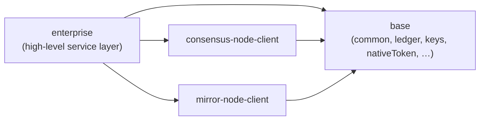
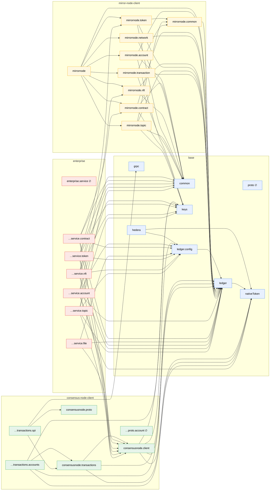

# Module / Namespace Dependencies

This document gives an overview of how the V3 API modules (namespaces) depend on each other. The graphs are derived
from the `requires {Type} from <namespace>` declarations in the spec files — an edge `A --> B` means "namespace `A`
imports one or more types from namespace `B`".

The namespaces group into the four `spec/` folders / layers:

- **base** — `common`, `grpc`, `proto`, `nativeToken`, `keys`, `ledger`, `ledger.config`, `hedera`
- **consensus-node-client** — `consensusnode.client`, `consensusnode.transactions[.accounts|.spi]`, `consensusnode.proto[.account]`
- **mirror-node-client** — `mirrornode` and its per-domain sub-namespaces
- **enterprise** — `enterprise.service[.account|.contract|.file|.token|.nft|.topic]`

## Layer overview

`mirror-node-client` and `consensus-node-client` are independent of each other; `enterprise` builds on top of
`consensus-node-client`, `mirror-node-client`, and `base`. Everything ultimately rests on `base`.

## Namespace dependency graph

`∅` marks namespaces that are still empty stubs (no types defined yet).

## Observations

- **Foundation:** `nativeToken` and `ledger` are the most depended-upon base namespaces; `common` (the `Page<$$T>`
  type) is required by most mirror-node namespaces and by every enterprise service that exposes paginated queries
  (`account`, `topic`, `nft`, `token`, `contract`).
- **No cycles:** the dependency graph is acyclic. (The earlier `keys ↔ keys.io` cycle was removed by merging the
  `keys.io` sub-namespace into `keys`.)
- **Clean layer separation:** `mirror-node-client` has no dependency on `consensus-node-client` (or vice versa), and
  `base` depends on nothing outside `base`. `enterprise` is the only layer that combines `consensus-node-client`,
  `mirror-node-client`, and `base` — the mirror-node edge was introduced so that the service layer can reuse the
  domain types (`Nft`, `NftMetadata`, `Token`, `TokenInfo`, `Balance`, `Contract`) for its query methods instead of
  redeclaring them.
- **Empty stubs (no edges):** `proto`, `consensusnode.proto.account`, and `enterprise.service` define no types yet.
  `consensusnode.proto` is used only by `consensusnode.transactions.spi`.
- **Hedera is base-resident:** `hedera` (HBAR + Hedera network settings) currently lives in the base layer and depends
  on `ledger.config` and `nativeToken` — see the open question in
  [`native-token.md`](base/native-token.md) about whether Hedera-specific namespaces should move out of `base`.

> The graphs are generated from the `requires` declarations; regenerate after changing imports.
